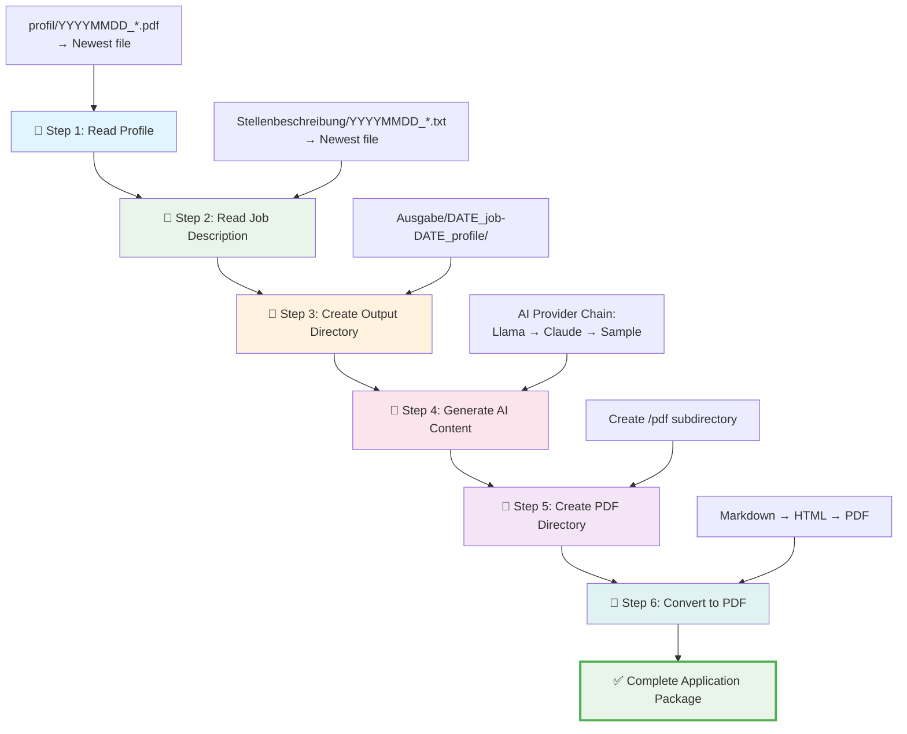
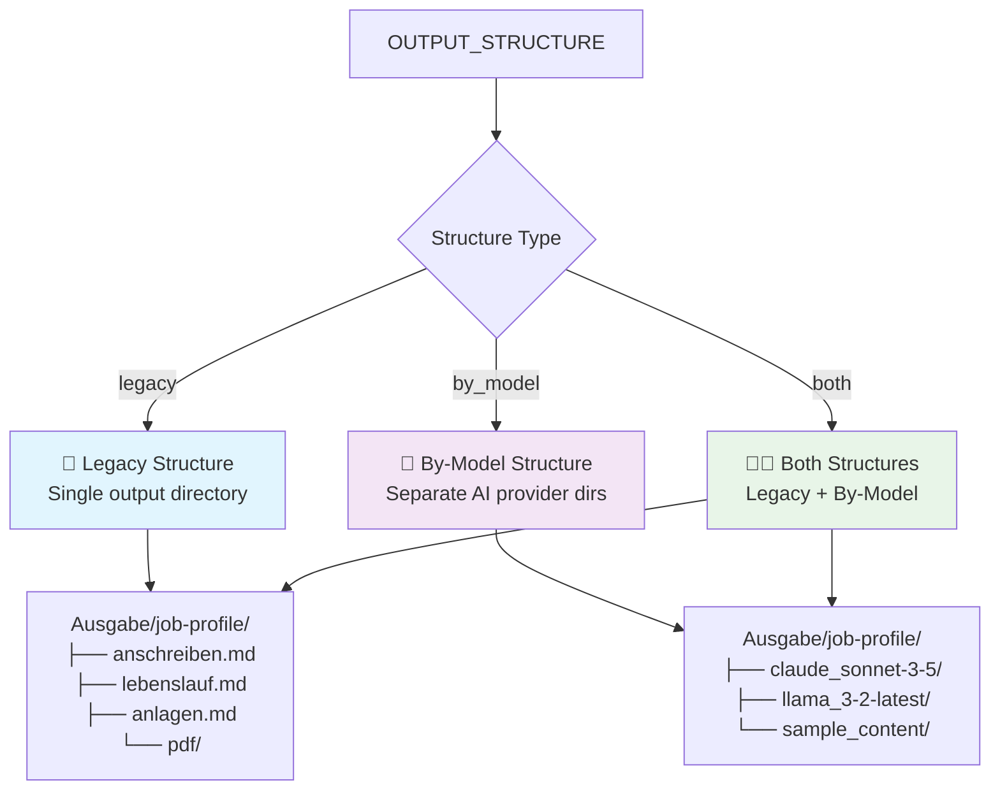

# Bewerbung Generator

**Professional Application Document Generator with AI Support**

An intelligent system for generating customized job application documents (cover letters, CVs, and attachments) using AI providers with automatic fallback mechanisms.


## 🚀 Quick Start

```bash
# Install dependencies
make install

# Generate application documents
make generate

# View documentation
make docs && make docs-serve
```

## 📋 Application Components

A complete application (Bewerbung) consists of:

- **Anschreiben** (Cover Letter) - AI-generated, personalized content
- **Lebenslauf** (CV/Resume) - Professional formatted resume
- **Anlagen** (Attachments) - Supporting documents
  - Certificates (Zeugnisse)
  - References (Referenzen) 
  - Additional documents


## 🔄 Generation Workflow

The application generation follows a structured 6-step process:



### Detailed Steps

1. **📁 Profile Reading** - Discovers and reads the newest profile file (pattern: `YYYYMMDD.*`) from `profil/` directory
2. **📄 Job Description Reading** - Reads the newest job description (pattern: `YYYYMMDD.*`) from `Stellenbeschreibung/` directory  
3. **📂 Output Directory Creation** - Creates structured output directory: `Ausgabe/{job_date}_{job_name}-{profile_date}_{profile_name}/`
4. **🤖 AI Content Generation** - Generates personalized content using AI provider chain (Llama → Claude → Sample fallback)
5. **📁 PDF Directory Setup** - Creates `/pdf` subdirectory for converted documents
6. **📄 PDF Conversion** - Converts all markdown documents to professional PDF format


## 🤖 AI Provider Support


## 📊 Output Structure Options



## 🛠️ System Requirements

### Dependencies
```bash
# macOS
brew install cffi fonttools pango pillow six

# Install Python dependencies
make install
```

### AI Provider Setup

**Option 1: Llama/Ollama (Recommended - Local & Private)**
```bash
# Install Ollama
curl -fsSL https://ollama.ai/install.sh | sh

# Setup Llama model
make setup-ollama
```

**Option 2: Claude API**
```bash
# Set API key
export ANTHROPIC_API_KEY="your-api-key"
```

## 📖 Documentation

- **[📚 Full Documentation](docs/_build/html/index.html)** - Complete user guide and API reference
- **[🚀 Quick Start Guide](docs/user_guide/quickstart.rst)** - Get started in minutes  
- **[⚙️ Configuration](docs/user_guide/configuration.rst)** - Customize your setup
- **[🏗️ Architecture](docs/development/architecture.rst)** - System design and components

## 🧪 Testing & Validation

```bash
# Run all tests
make test

# Test AI providers
make test-providers

# Test regeneration
make test-regeneration

# Analyze content variants
make variants
```

