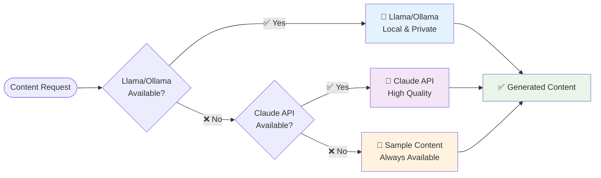

# Bewerbung Generator

**Professional Application Document Generator with AI Support**

An intelligent system for generating customized job application documents (cover letters, CVs, and attachments) using AI providers with automatic fallback mechanisms.


## 🚀 Quick Start

```bash
# Install dependencies
make install

# Generate application documents
make generate

# View documentation
make docs && make docs-serve
```

## 📋 Application Components

A complete application (Bewerbung) consists of:

- **Anschreiben** (Cover Letter) - AI-generated, personalized content
- **Lebenslauf** (CV/Resume) - Professional formatted resume
- **Anlagen** (Attachments) - Supporting documents
  - Certificates (Zeugnisse)
  - References (Referenzen) 
  - Additional documents


## 🔄 Generation Workflow

The application generation follows a structured 7-step process:

```mermaid
flowchart TD
    A0[🗑️ Step 0: Clear AI Cache] --> A[📁 Step 1: Read Profile]
    A --> B[📄 Step 2: Read Job Description]
    B --> C[📂 Step 3: Create Output Directory]
    C --> D[🤖 Step 4: Generate AI Content]
    D --> E[📁 Step 5: Create PDF Directory]
    E --> F[📄 Step 6: Convert to PDF]
    
    A01[.cache/ai_content_cache.json<br/>→ Clear for fresh content] --> A0
    A1[profil/YYYYMMDD_*.pdf<br/>→ Newest file] --> A
    B1[Stellenbeschreibung/YYYYMMDD_*.txt<br/>→ Newest file] --> B
    C1[Ausgabe/DATE_job-DATE_profile/] --> C
    D1[AI Provider Chain:<br/>Llama → Claude → Sample<br/>(Fresh content, no cache)] --> D
    E1[Create /pdf subdirectory] --> E
    F1[Markdown → HTML → PDF] --> F
    
    F --> G[✅ Complete Application Package]
    
    style A0 fill:#ffebee
    style A fill:#e1f5fe
    style B fill:#e8f5e8
    style C fill:#fff3e0
    style D fill:#fce4ec
    style E fill:#f3e5f5
    style F fill:#e0f2f1
    style G fill:#e8f5e8,stroke:#4caf50,stroke-width:3px
```

### Detailed Steps

0. **🗑️ AI Cache Clearing** - Clears existing AI content cache (`.cache/ai_content_cache.json`) to ensure fresh content generation
1. **📁 Profile Reading** - Discovers and reads the newest profile file (pattern: `YYYYMMDD.*`) from `profil/` directory
2. **📄 Job Description Reading** - Reads the newest job description (pattern: `YYYYMMDD.*`) from `Stellenbeschreibung/` directory  
3. **📂 Output Directory Creation** - Creates structured output directory: `Ausgabe/{job_date}_{job_name}-{profile_date}_{profile_name}/`
4. **🤖 AI Content Generation** - Generates personalized content using AI provider chain (Llama → Claude → Sample fallback) with fresh, non-cached content
5. **📁 PDF Directory Setup** - Creates `/pdf` subdirectory for converted documents
6. **📄 PDF Conversion** - Converts all markdown documents to professional PDF format


## 🤖 AI Provider Support



## 🏗️ Directory-Only Output Structure

The generator uses a **clean directory-only structure** for organized output:

```mermaid
flowchart TD
    Config[OUTPUT_STRUCTURE="by_model"] --> Structure[🗂️ Directory-Only Structure]
    
    Structure --> Output[Ausgabe/job-profile/<br/>├── sample_content/<br/>│   ├── anschreiben.md<br/>│   ├── lebenslauf.md<br/>│   ├── README.md<br/>│   └── pdf/<br/>├── claude_sonnet_3_5/<br/>│   ├── anschreiben.md<br/>│   ├── lebenslauf.md<br/>│   └── pdf/<br/>└── llama_3_1_8b/<br/>    ├── anschreiben.md<br/>    └── pdf/]
    
    Structure --> Benefits[✅ Benefits<br/>• No root files<br/>• Clean separation<br/>• Easy comparison<br/>• Provider-specific docs]
    
    style Structure fill:#e8f5e8
    style Output fill:#f3e5f5
    style Benefits fill:#e1f5fe
```

**Key Features:**
- **No Root Files**: All documents are contained within AI provider subdirectories
- **Clean Organization**: Each AI provider gets its own folder (e.g., `sample_content/`, `claude_sonnet_3_5/`)
- **Easy Comparison**: Compare outputs from different AI providers side-by-side
- **Self-Contained**: Each folder includes provider-specific documentation and PDFs

## 🛠️ System Requirements

### Dependencies
```bash
# macOS
brew install cffi fonttools pango pillow six

# Install ripgrep for fast code searching
brew install ripgrep

# Install Python dependencies
make install
```

### AI Provider Setup

**Option 1: Llama/Ollama (Recommended - Local & Private)**
```bash
# Install Ollama
curl -fsSL https://ollama.ai/install.sh | sh

# Setup Llama model
make setup-ollama
```

**Option 2: Claude API**
```bash
# Set API key
export ANTHROPIC_API_KEY="your-api-key"
```

## 🗑️ Cache Management

The system automatically clears AI content cache before each generation to ensure fresh content. You can control this behavior:

### Automatic Cache Clearing (Default)
```bash
# Normal generation - cache cleared automatically
make generate

# Explicitly generate with fresh content
make generate-fresh
```

### Cache Control Options
```bash
# Generate while preserving existing cache
make generate-cached

# Manually clear cache only
make clear-cache

# Check cache status and statistics
make cache-status

# Disable automatic cache clearing via environment variable
export CLEAR_CACHE_ON_START=false
make generate
```

### Cache File Location
- **Cache file**: `.cache/ai_content_cache.json`
- **Content**: Stores AI-generated text sections by content type
- **Behavior**: Automatically cleared on each generation for fresh content

## 📖 Documentation

- **[📚 Full Documentation](docs/_build/html/index.html)** - Complete user guide and API reference
- **[🚀 Quick Start Guide](docs/user_guide/quickstart.rst)** - Get started in minutes  
- **[⚙️ Configuration](docs/user_guide/configuration.rst)** - Customize your setup
- **[🏗️ Architecture](docs/development/architecture.rst)** - System design and components

## 🧪 Testing & Validation

```bash
# Run all tests
make test

# Test AI providers
make test-providers

# Test regeneration
make test-regeneration

# Analyze content variants
make variants
```

